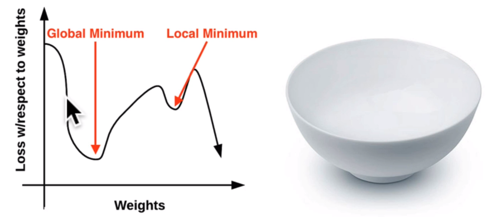

# gradient-desent-python

Gradient-descent is an optimization technique

Sigmoid activation function:

sigmoid = 1 / (1 + e^-x)
derivative of sigmoid = s(x) * (1 - s(x))

sigmoid value range between : 0 to 1
if the value less than 0.5 -> 0
if the value greater than 0.5 -> 1

# Gradient descent:
Wnew = Wold - (learning rate)*de/dw

(derivative-of-error with respect to derivative-of-weight)